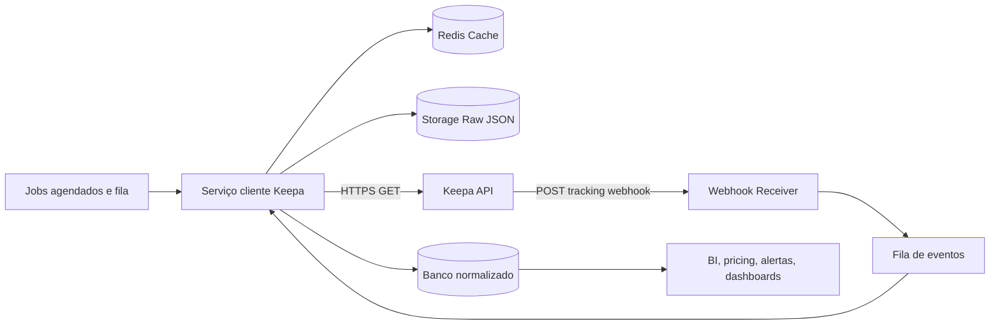
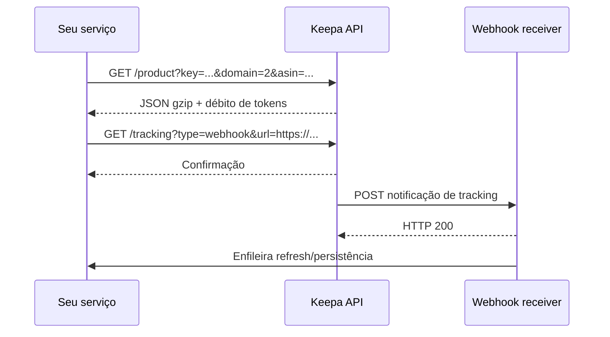

# Guia rigoroso de implementação da Keepa API

## Nota normativa para o projeto Sourcing Analyzer Center

Este arquivo foi versionado como referência interna, mas o uso no projeto deve obedecer às correções obrigatórias consolidadas no `SDD.md`.

Regras que prevalecem para implementação:

- `offers` no `/product` é um inteiro que define a quantidade de ofertas solicitadas; neste projeto, use a faixa operacional `20–100`.
- Quando `offers` está presente, o batch máximo do `/product` cai para 20 ASINs por request.
- Quando `offers` está presente, `buybox` é ignorado/redundante; não enviar `buybox=1` junto com requests de fallback de ofertas.
- O payload raw de produto usa `csv` como array bidimensional indexado por `CsvType` (`int[][]` no modelo Java oficial), não como objeto textual com chaves como `AMAZON` ou `SALES`.
- Exemplos com `csv` humanizado neste guia são apenas ilustrações de camada normalizada/wrapper, não shape raw da API.
- `reviews.ratingCount` / histórico de rating count não é atualizado desde `April 9th 2025`.
- `CsvType.NEW` não inclui custos de shipping em coletas anteriores a `Feb 16th 2026`.
- Webhook de tracking confirmado no `Request.java`: ack HTTP `200`; se a entrega falhar, há segunda tentativa após `15 seconds`.
- Preços de planos Keepa permanecem pendentes até confirmação no portal Keepa autenticado; tabelas de preços de fontes secundárias neste guia não são fonte de verdade comercial.
- Antes de usar `/search` com `asins-only` em código produtivo, executar SMOKE real controlado para confirmar shape enxuto de ASINs, payload retornado e impacto de tokens.

## Resumo executivo

A Keepa API é uma API HTTP sobre HTTPS, orientada a consultas GET, com autenticação por chave de API e respostas em JSON; a documentação e os SDKs consultados mostram que a integração gira em torno de alguns blocos principais: consulta de produto, categorias, busca, sellers, deals, best sellers, Product Finder, lightning deals, tracking e webhooks. O modelo de consumo é baseado em **tokens por minuto**: tokens não usados expiram após **uma hora**, o cliente oficial/community consultado expõe utilitários para esperar reposição de tokens, e há custos adicionais em algumas opções de consulta, como `buybox`; por outro lado, `stats` não adiciona custo extra. Em termos de modelagem, o payload de produto mistura **metadados atuais** com séries históricas em formato compacto (`csv`), usando **inteiros na menor unidade monetária do marketplace** e **timestamps em “Keepa time”**. citeturn31view0turn6view0turn7view3turn19view0turn37search4

Na prática, a melhor estratégia de implementação é tratar a Keepa como uma fonte de dados analítica: usar cache agressivo, limitar concorrência por orçamento de tokens, separar armazenamento **raw JSON** e **camada normalizada**, criar retries apenas para falhas transitórias, e isolar endpoints mais caros como `offers`, `buybox` e tracking/webhooks. Para Java e PHP há frameworks oficiais mantidos pela própria Keepa; para Python há uma biblioteca bastante ativa e uma documentação extensa; para Node.js, na varredura priorizada desta pesquisa, não apareceu um SDK oficial equivalente, então a abordagem mais confiável é usar HTTP direto ou gerar cliente a partir de uma especificação OpenAPI não oficial. citeturn10search2turn34search0turn28search0turn38search7turn29view0

Há duas cautelas importantes para produção. A primeira é de orçamento: as fontes recentes concordam nos **add-ons de tokens por minuto**, mas há divergência recente em fontes secundárias sobre o preço da assinatura-base da Keepa em 2026, então o valor de entrada deve ser confirmado no portal antes da contratação. A segunda é de compatibilidade: os releases oficiais recentes mostram mudanças de schema e de semântica, incluindo novos campos, status `NOT_FOUND`, deprecações, remoções de atributos e mudanças históricas de certos dados. citeturn8search0turn10search1turn8search2turn23view0turn33search2

## Fontes levantadas

### Conector habilitado e documentos recuperados

**Conectores habilitados:** Adobe Acrobat.

**Documentos recuperados via Adobe Acrobat:** nenhum documento pesquisável foi retornado nesta sessão. O conector disponível expôs ferramentas operacionais de PDF, mas não apresentou um repositório documental consultável para embasar a pesquisa.

### Outras fontes priorizadas na web

Como o conector não trouxe conteúdo documental, a pesquisa aprofundou-se em fontes web de maior autoridade e utilidade técnica. A base principal veio dos repositórios oficiais da Keepa no GitHub, da documentação da biblioteca Python `keepa`, do pacote oficial PHP no Packagist, dos releases oficiais do framework Java e de uma thread do Stack Overflow útil para paginação/fatiamento de Product Finder. Para preços, usei fontes secundárias recentes, porque a página oficial de billing/planos não estava plenamente acessível em formato estático durante esta sessão. citeturn11search1turn34search0turn28search0turn23view0turn21view0turn8search0turn10search1

## Mapa da API, autenticação e modelos de dados

### Autenticação, transporte e limites operacionais

A especificação OpenAPI comunitária, usada aqui apenas como apoio para o HTTP bruto, descreve `https://api.keepa.com/` como endpoint de produção, exige a chave `key` em query string e recomenda HTTPS, gzip, keep-alive e paralelismo controlado. A documentação Python da biblioteca `keepa` também informa que a access key tem **64 caracteres** e que a validação inicial da chave (`check_key`) pode ser feita sem custo de token. citeturn31view0turn6view0

O modelo de capacidade é orientado a **tokens por minuto**. A própria documentação Python resume que um token pode recuperar o dataset completo de um produto, e que tokens não utilizados expiram após **uma hora**. Na mesma documentação, `stats` é explicitamente “sem custo extra”, `buybox` adiciona **2 tokens por produto**, `update=0` pode custar token extra por forçar dado vivo, `seller_query` custa **1 token por seller**, e `offers` aumenta o custo e também impõe limite menor de ASINs por request quando usado. citeturn5search0turn7view3turn5search1turn14view0

### Visão geral dos endpoints

A tabela abaixo consolida as famílias de endpoints que aparecem de forma consistente nas fontes oficiais consultadas.

| Família | Rota / forma | Finalidade principal | Observações operacionais |
|---|---|---|---|
| Produto | `/product` | Consultar 1 a 100 ASINs, ou códigos UPC/EAN/ISBN-13 | Com `offers`, o lote efetivo cai para no máximo 20 ASINs; aceita `stats`, `history`, `update`, `rating`, `buybox`, `videos`, `aplus`, `stock`, `days` |
| Busca de produto | `/search?type=product` | Busca por termo com até 50 resultados por termo | `page` vai de 0 a 9; cada página tem até 10 resultados; sem `page`, a resposta inicial retorna até 40 |
| Busca de categoria | `/search?type=category` | Localizar categorias por nome | Pode incluir árvore de pais |
| Categoria | `/category` | Lookup de categoria por node id | Pode consultar `0` para categorias raiz; até 10 ids em batch com mesmo custo |
| Best sellers | `/bestsellers` | Lista ordenada por vendas dentro de categoria/grupo | Categorias raiz podem chegar a 100.000 ASINs; subcategorias a 3.000; atualização diária |
| Seller | `/seller` | Dados do merchant e, opcionalmente, storefront | Batch até 100 seller IDs; `storefront` pode trazer lista enorme de ASINs |
| Top sellers | `/topseller` | Lista de sellers mais bem avaliados | China não é suportada para dados de seller |
| Product Finder | `/query` | Filtro avançado por centenas de critérios | É o endpoint “pesado” para descoberta em escala |
| Deals | `/deal` | Encontrar ofertas com mudanças recentes | Cada request retorna no máximo 150 deals |
| Lightning deals | `/lightningdeal` | Ofertas relâmpago atuais e futuras | Atualização a cada 10 minutos |
| Tracking | `/tracking` com `type=add|get|list|notification|remove|removeAll|webhook` | Alertas e automações | Webhook oficial por POST |
| Graph Image API | via método `download_graph_image` | Gerar PNG do gráfico do produto | Mesmo request reaproveitado por 90 min não consome token novamente |

Compilação da tabela baseada nas fontes oficiais e semioficiais pesquisadas. citeturn13view0turn14view0turn15view0turn6view0turn40search2turn34search0

### Rate limits e faixas de preço

A parte mais estável do pricing recente é o **add-on de tokens por minuto**. Já a assinatura-base necessária para liberar uso do portal/API aparece com divergência em fontes recentes de 2026: uma fonte informa **€19/mês**; outra reporta um reajuste para **€29/mês** a partir de 2026. Por isso, trate o valor-base abaixo como **“confirmar no checkout”**. Os add-ons, por outro lado, aparecem de forma consistente nas fontes recentes consultadas. citeturn10search1turn8search2turn8search0

| Add-on API | Tokens/min | Queries padrão/hora | Queries com `buybox` por hora | Preço mensal observado |
|---|---:|---:|---:|---:|
| Plano 20 | 20 | 1.200 | ~400 | €49 |
| Plano 60 | 60 | 3.600 | ~1.200 | €129 |
| Plano 250 | 250 | 15.000 | ~5.000 | €459 |
| Plano 500 | 500 | 30.000 | ~10.000 | €879 |
| Plano 1.000 | 1.000 | 60.000 | ~20.000 | €1.499 |
| Plano 2.000 | 2.000 | 120.000 | ~40.000 | €2.499 |
| Plano 3.000 | 3.000 | 180.000 | ~60.000 | €3.499 |
| Plano 4.000 | 4.000 | 240.000 | ~80.000 | €4.499 |

A coluna de `buybox` é uma **inferência operacional**: 1 token base por produto + 2 tokens adicionais documentados para `buybox`. Para `offers`, a documentação oficial afirma apenas que consome mais tokens e impõe restrições adicionais de payload; eu recomendo medir com logs do seu caso real em vez de assumir um multiplicador fixo. citeturn7view3turn5search0turn8search0turn10search1

### Modelos de dados e formato de resposta

O objeto de produto é amplo: nas fontes oficiais ele inclui campos como `asin`, `domainId`, `parentAsin`, `upcList`, `eanList`, `gtinList`, `images`, `categories`, `rootCategory`, `manufacturer`, `title`, `trackingSince`, `productType`, `reviews`, `stats`, `offers`, `liveOffersOrder`, `coupon`, `couponHistory`, `newPriceIsMAP`, `materials`, `specialFeatures`, `deals` e o grande bloco histórico `csv`. O `csv` é um array bidimensional indexado por `CsvType`; cada série usa o formato alternado `timestamp, valor, timestamp, valor...`. Preços são inteiros na menor unidade monetária do marketplace; o comentário oficial dá o exemplo de **4900 = $49,00** em um marketplace decimal, e no Japão o mesmo valor representa **¥4900**. Valor `-1` indica ausência de oferta naquele instante. citeturn37search4turn33search2

O objeto `stats`, quando solicitado, entrega `current`, `avg`, `avg30`, `avg90`, `avg180`, `avg365`, `atIntervalStart`, `min`, `max`, `isLowest`, percentuais/out-of-stock, `lightningDealInfo`, estoques agregados, buy box atual, buy box flags (`buyBoxIsFBA`, `buyBoxIsPrimeEligible`, etc.), seller do buy box, estatísticas por seller e contadores de `salesRankDrops`. Isso torna `stats` extremamente valioso para analytics e para paginação por “janelas” quando o Product Finder devolve volume excessivo. citeturn19view0turn21view0

Um payload mínimo de referência, já “humanizado”, costuma ficar conceitualmente assim:

```json
{
  "asin": "B0088PUEPK",
  "title": "Exemplo",
  "domainId": 2,
  "images": [{"l": "81abc.jpg"}],
  "csv": {
    "AMAZON": [[411180, 4900], [411240, 4799]],
    "SALES": [[411180, 1250], [411240, 1204]]
  },
  "stats": {
    "current": {"AMAZON": 4799, "SALES": 1204},
    "avg90": {"AMAZON": 4890, "SALES": 1600}
  },
  "offers": [
    {
      "sellerId": "A2L77EE7U53NWQ",
      "isFBA": true
    }
  ]
}
```

Esse JSON é **ilustrativo**; a resposta real vem compactada em arrays indexados e, em wrappers, costuma ser reformatada para estruturas mais convenientes. citeturn37search4turn19view0turn26search4

## Implementação passo a passo em Node.js, Python e Java

### Estratégia recomendada

Para integrações próprias, a abordagem mais previsível é encapsular o HTTP bruto em um “client” seu. Isso lhe dá controle de retries, logs, redaction de URL, particionamento por endpoint e observabilidade. Se quiser acelerar o go-live, use o SDK oficial em Java, o framework oficial em PHP, ou a biblioteca `keepa` em Python; mas mantenha a semântica de negócio fora do wrapper para reduzir lock-in. citeturn10search2turn34search0turn28search0

### Exemplo em Node.js

Este exemplo usa `fetch` nativo do Node 18+, autenticação por query string, retry exponencial com jitter, paginação do endpoint de busca de produto e configuração de webhook de tracking.

```js
// keepa-client.mjs
import { setTimeout as sleep } from "node:timers/promises";

const BASE_URL = "https://api.keepa.com";
const API_KEY = process.env.KEEPA_API_KEY;

if (!API_KEY) {
  throw new Error("Defina KEEPA_API_KEY no ambiente.");
}

function buildUrl(path, params = {}) {
  const url = new URL(path, BASE_URL);
  url.searchParams.set("key", API_KEY);

  for (const [k, v] of Object.entries(params)) {
    if (v === undefined || v === null) continue;
    url.searchParams.set(k, String(v));
  }

  return url;
}

async function keepaGet(path, params = {}, { attempts = 5 } = {}) {
  let lastError;

  for (let attempt = 1; attempt <= attempts; attempt++) {
    const url = buildUrl(path, params);

    try {
      const res = await fetch(url, {
        method: "GET",
        headers: {
          "Accept": "application/json",
          "Accept-Encoding": "gzip",
          "Connection": "keep-alive",
          "User-Agent": "meu-servico-keepa/1.0"
        }
      });

      if (res.ok) {
        return await res.json();
      }

      const body = await res.text();

      // Retry apenas em falha transitória
      if ([429, 500, 502, 503, 504].includes(res.status) && attempt < attempts) {
        const backoffMs = Math.min(8000, 500 * (2 ** (attempt - 1))) + Math.floor(Math.random() * 250);
        await sleep(backoffMs);
        continue;
      }

      throw new Error(`Keepa HTTP ${res.status}: ${body}`);
    } catch (err) {
      lastError = err;

      if (attempt < attempts) {
        const backoffMs = Math.min(8000, 500 * (2 ** (attempt - 1))) + Math.floor(Math.random() * 250);
        await sleep(backoffMs);
        continue;
      }
    }
  }

  throw lastError;
}

export function keepaMinuteToDate(keepaMinute) {
  const epochMs = Date.UTC(2011, 0, 1, 0, 0, 0);
  return new Date(epochMs + keepaMinute * 60_000);
}

export function fromMinorUnit(value, marketplace = "GB") {
  if (value == null || value < 0) return null;
  // Para JP, o inteiro já representa ienes.
  return marketplace === "JP" ? value : value / 100;
}

export async function getProduct({ domain = 2, asin, stats = 90, history = 1, buybox = 0 }) {
  return keepaGet("/product", { domain, asin, stats, history, buybox });
}

export async function searchProducts({ domain = 2, term }) {
  const asins = [];

  for (let page = 0; page <= 9; page++) {
    const data = await keepaGet("/search", {
      domain,
      type: "product",
      term,
      page,
      history: 0,
      "asins-only": 1
    });

    const batch = data.asinList ?? data.asins ?? [];
    asins.push(...batch);

    if (batch.length < 10) break;
  }

  return asins;
}

export async function configureTrackingWebhook(webhookUrl) {
  return keepaGet("/tracking", {
    type: "webhook",
    url: webhookUrl
  });
}

// Exemplo de execução
const product = await getProduct({
  domain: 2, // Amazon UK
  asin: "B0088PUEPK",
  stats: 90,
  history: 1,
  buybox: 1
});

console.log(JSON.stringify(product, null, 2));

const found = await searchProducts({
  domain: 2,
  term: "instant coffee"
});

console.log("ASINs encontrados:", found.length);
```

O desenho do helper acima segue as fontes que indicam HTTPS GET, query param `key`, gzip e keep-alive. A paginação de product search vai de `page=0` até `page=9`, com 10 itens por página; sem `page`, a primeira resposta tende a devolver até 40. Para `product`, é seguro trabalhar com até 100 ASINs por request, mas se `offers` estiver habilitado o lote deve ser reduzido para no máximo 20. citeturn31view0turn13view0turn14view0

Um receiver mínimo para webhook de tracking, com ack `200` e enfileiramento posterior, pode ser assim:

```js
// webhook-server.mjs
import express from "express";

const app = express();
app.use(express.json({ limit: "256kb" }));

app.post("/webhooks/keepa", async (req, res) => {
  try {
    const notification = req.body;

    // Valide origem/autorização no seu gateway reverso.
    // A documentação consultada descreve POST + HTTP 200,
    // mas não documenta assinatura criptográfica do payload.
    console.log("Notificação Keepa recebida:", notification);

    // Enfileire o processamento; não faça lógica pesada aqui.
    res.sendStatus(200);
  } catch (err) {
    console.error(err);
    res.sendStatus(500);
  }
});

app.listen(3000, () => {
  console.log("Webhook receiver na porta 3000");
});
```

A Keepa documenta que o webhook de tracking é uma chamada **HTTP POST** com um único objeto de notificação; o seu servidor deve responder **200** para confirmar recebimento, e, se a entrega falhar, a Keepa faz **uma nova tentativa após 15 segundos**. citeturn13view0

### Exemplo em Python

Em Python, você pode seguir por HTTP bruto ou usar a biblioteca `keepa`. Abaixo vai uma opção híbrida: HTTP bruto para controle fino e, quando fizer sentido, uso do wrapper para espera automática por tokens.

```python
# keepa_client.py
import os
import time
import random
import requests
from datetime import datetime, timedelta, timezone

BASE_URL = "https://api.keepa.com"
API_KEY = os.environ.get("KEEPA_API_KEY")

if not API_KEY:
    raise RuntimeError("Defina KEEPA_API_KEY no ambiente.")

session = requests.Session()
session.headers.update({
    "Accept": "application/json",
    "Accept-Encoding": "gzip",
    "Connection": "keep-alive",
    "User-Agent": "meu-servico-keepa/1.0"
})

def keepa_minute_to_datetime(keepa_minute: int) -> datetime:
    return datetime(2011, 1, 1, tzinfo=timezone.utc) + timedelta(minutes=keepa_minute)

def from_minor_unit(value: int | None, marketplace: str = "GB"):
    if value is None or value < 0:
        return None
    return value if marketplace == "JP" else value / 100

def keepa_get(path: str, params: dict, attempts: int = 5):
    params = {"key": API_KEY, **params}
    last_exc = None

    for attempt in range(1, attempts + 1):
        try:
            resp = session.get(f"{BASE_URL}{path}", params=params, timeout=30)

            if resp.ok:
                return resp.json()

            if resp.status_code in {429, 500, 502, 503, 504} and attempt < attempts:
                backoff = min(8.0, 0.5 * (2 ** (attempt - 1))) + random.uniform(0, 0.25)
                time.sleep(backoff)
                continue

            raise RuntimeError(f"Keepa HTTP {resp.status_code}: {resp.text[:1000]}")
        except requests.RequestException as exc:
            last_exc = exc
            if attempt < attempts:
                backoff = min(8.0, 0.5 * (2 ** (attempt - 1))) + random.uniform(0, 0.25)
                time.sleep(backoff)
                continue

    raise last_exc if last_exc else RuntimeError("Falha desconhecida ao chamar Keepa.")

def get_products(asins: list[str], domain: int = 2, stats=90, history=1, offers=None, buybox=0):
    if offers and len(asins) > 20:
        raise ValueError("Com offers habilitado, use no máximo 20 ASINs por request.")
    if not offers and len(asins) > 100:
        raise ValueError("Use no máximo 100 ASINs por request.")

    return keepa_get("/product", {
        "domain": domain,
        "asin": ",".join(asins),
        "stats": stats,
        "history": history,
        "buybox": buybox,
        "offers": offers
    })

def search_products(term: str, domain: int = 2) -> list[str]:
    all_asins = []

    for page in range(10):
        data = keepa_get("/search", {
            "domain": domain,
            "type": "product",
            "term": term,
            "page": page,
            "history": 0,
            "asins-only": 1
        })

        batch = data.get("asinList") or data.get("asins") or []
        all_asins.extend(batch)

        if len(batch) < 10:
            break

    return all_asins

def configure_webhook(url: str):
    return keepa_get("/tracking", {
        "type": "webhook",
        "url": url
    })

if __name__ == "__main__":
    data = get_products(["B0088PUEPK"], domain=2, stats=90, history=1, buybox=1)
    print(data)

    asins = search_products("instant coffee", domain=2)
    print(f"Encontrados {len(asins)} ASINs")
```

Se você preferir delegar parte da lógica de espera de tokens ao wrapper Python, a biblioteca `keepa` expõe `check_key`, `wait_for_tokens`, `time_to_refill` e um método `query` bastante maduro, inclusive com async. citeturn6view0turn5search1turn28search0

```python
import keepa

api = keepa.Keepa(os.environ["KEEPA_API_KEY"], check_key=True)
api.wait_for_tokens()

products = api.query(
    ["B0088PUEPK"],
    domain="GB",
    stats=90,
    history=True,
    buybox=True,
    wait=True
)

print(products[0]["asin"], products[0]["title"])
print("Tempo até refill:", api.time_to_refill)
```

### Exemplo em Java

Em Java, a Keepa mantém um framework oficial; mesmo assim, para quem quer previsibilidade máxima ou integração em uma base moderna com `HttpClient`, o HTTP bruto é simples e suficiente.

```java
// KeepaClient.java
import java.io.IOException;
import java.net.URI;
import java.net.URLEncoder;
import java.net.http.*;
import java.nio.charset.StandardCharsets;
import java.time.Duration;
import java.util.LinkedHashMap;
import java.util.Map;

public class KeepaClient {
    private static final String BASE_URL = "https://api.keepa.com";
    private final String apiKey;
    private final HttpClient httpClient;

    public KeepaClient(String apiKey) {
        this.apiKey = apiKey;
        this.httpClient = HttpClient.newBuilder()
                .connectTimeout(Duration.ofSeconds(10))
                .build();
    }

    private String buildUrl(String path, Map<String, String> params) {
        StringBuilder sb = new StringBuilder(BASE_URL).append(path).append("?key=")
                .append(URLEncoder.encode(apiKey, StandardCharsets.UTF_8));

        for (Map.Entry<String, String> entry : params.entrySet()) {
            if (entry.getValue() == null) continue;
            sb.append("&")
              .append(URLEncoder.encode(entry.getKey(), StandardCharsets.UTF_8))
              .append("=")
              .append(URLEncoder.encode(entry.getValue(), StandardCharsets.UTF_8));
        }
        return sb.toString();
    }

    public String get(String path, Map<String, String> params) throws Exception {
        Exception last = null;

        for (int attempt = 1; attempt <= 5; attempt++) {
            try {
                HttpRequest request = HttpRequest.newBuilder()
                        .uri(URI.create(buildUrl(path, params)))
                        .timeout(Duration.ofSeconds(30))
                        .header("Accept", "application/json")
                        .header("Accept-Encoding", "gzip")
                        .header("Connection", "keep-alive")
                        .header("User-Agent", "meu-servico-keepa/1.0")
                        .GET()
                        .build();

                HttpResponse<String> response = httpClient.send(request, HttpResponse.BodyHandlers.ofString());

                int status = response.statusCode();
                if (status >= 200 && status < 300) {
                    return response.body();
                }

                if ((status == 429 || status >= 500) && attempt < 5) {
                    long backoffMs = Math.min(8000, 500L * (1L << (attempt - 1)));
                    Thread.sleep(backoffMs);
                    continue;
                }

                throw new IOException("Keepa HTTP " + status + ": " + response.body());
            } catch (Exception ex) {
                last = ex;
                if (attempt < 5) {
                    long backoffMs = Math.min(8000, 500L * (1L << (attempt - 1)));
                    Thread.sleep(backoffMs);
                }
            }
        }
        throw last;
    }

    public static void main(String[] args) throws Exception {
        String apiKey = System.getenv("KEEPA_API_KEY");
        KeepaClient client = new KeepaClient(apiKey);

        Map<String, String> productParams = new LinkedHashMap<>();
        productParams.put("domain", "2");   // Amazon UK
        productParams.put("asin", "B0088PUEPK");
        productParams.put("stats", "90");
        productParams.put("history", "1");
        productParams.put("buybox", "1");

        String productJson = client.get("/product", productParams);
        System.out.println(productJson);

        for (int page = 0; page <= 9; page++) {
            Map<String, String> searchParams = new LinkedHashMap<>();
            searchParams.put("domain", "2");
            searchParams.put("type", "product");
            searchParams.put("term", "instant coffee");
            searchParams.put("page", String.valueOf(page));
            searchParams.put("history", "0");
            searchParams.put("asins-only", "1");

            String pageJson = client.get("/search", searchParams);
            System.out.println("Página " + page + ": " + pageJson);

            // Pare quando a sua desserialização detectar menos de 10 resultados.
        }

        Map<String, String> webhookParams = new LinkedHashMap<>();
        webhookParams.put("type", "webhook");
        webhookParams.put("url", "https://sua-api.exemplo.com/webhooks/keepa");
        String webhookResult = client.get("/tracking", webhookParams);
        System.out.println(webhookResult);
    }
}
```

Se você preferir o framework oficial, ele é especialmente útil quando você quer trabalhar diretamente com `Request.getProductRequest(...)`, `Request.getProductSearchRequest(...)` e os objetos tipados da resposta. O repositório oficial descreve suporte assíncrono/paralelo e infraestrutura pronta para análise de séries históricas. citeturn10search2turn13view0

## SDKs, bibliotecas e operação em produção

### Comparativo de SDKs e bibliotecas

| Nome | Linguagem | Situação de manutenção | Instalação | Exemplo de uso | Licença | Link |
|---|---|---|---|---|---|---|
| `keepacom/api_backend` | Java | **Ativo / oficial** | Maven/Gradle com repositório `https://keepa.com/maven/` | `Request.getProductRequest(...)` | Apache-2.0 | `keepacom/api_backend` |
| `keepa/php_api` | PHP | **Ativo / oficial** | `composer require keepa/php_api:*` | `sendRequestWithRetry(...)` | Apache-2.0 | `keepacom/php_api` |
| `keepa` | Python | **Ativo / community maduro** | `pip install keepa` | `api = keepa.Keepa(KEY)` | Apache | `akaszynski/keepa` |
| `keepaAPI` | Python | **Legado / baixo ímpeto de evolução** | `pip install keepaAPI` | `api.ProductQuery(...)` | não ficou claro no snippet indexado | `KenAhon/keepaAPI` |
| `keepaOpenAPI` | OpenAPI 3.0 | **Útil, mas não oficial** | gerar cliente com OpenAPI Generator | gera clients HTTP | MIT | `h2ouw8n4/keepaOpenAPI` |

A classificação acima foi montada com base nos repositórios oficiais, releases recentes e registries consultados. O framework Java teve releases oficiais em 2026; o pacote PHP oficial publicou versão `3.0.1` em março de 2026; o pacote Python `keepa` publicou `1.4.4` em fevereiro de 2026. Já o `keepaOpenAPI` afirma explicitamente não ser gerido pelos donos do serviço. citeturn23view0turn34search0turn28search0turn29view0turn26search1

### Boas práticas de performance, cache, storage e segurança

Como a chave da API é passada em **query string**, nunca chame a Keepa diretamente do frontend/browser. Faça chamadas apenas do backend, redija URLs em logs, não grave query strings completas em APM e configure filtros de segredo em proxies, balanceadores e observabilidade. Isso é especialmente importante porque a própria especificação consultada documenta `key` em query param. citeturn31view0

No plano de dados, trate o endpoint `/product` como o seu “fato base” e normalize em duas camadas. A primeira camada guarda a resposta completa, idealmente em armazenamento barato e versionado; a segunda extrai tabelas como `products_current`, `product_stats`, `product_csv_history`, `offers_live`, `offers_history`, `categories`, `seller_profiles` e `tracking_notifications`. Guarde o **Keepa minute bruto** e também o timestamp convertido; isso facilita reprocessamento e regressões de parser quando o schema evoluir. Essa recomendação decorre diretamente do formato compacto `csv[][]` e do objeto `stats`. citeturn37search4turn19view0

Em performance, priorize cinco otimizações. Primeiro, desligue `history` quando você não precisa de série histórica. Segundo, use `days` para truncar janela histórica quando o caso é apenas operacional. Terceiro, use `only-live-offers` quando você só quer mercado ao vivo. Quarto, evite `update=0` como padrão; deixe-o para casos de verdadeiramente “live”. Quinto, se você consome imagens de gráfico, aproveite o cache oficial de 90 minutos no Graph Image API. citeturn15view0turn40search2

### Erros comuns, troubleshooting e logs de referência

Os problemas mais comuns em produção não costumam ser “bugs da API”, mas desequilíbrios de custo, paginação, volume e schema. A tabela abaixo resume os cenários que mais merecem playbooks.

| Sintoma | Causa provável | Correção prática |
|---|---|---|
| `401/400` logo no início | chave ausente, inválida ou vazando incorretamente no URL | valide variável de ambiente; sanitize query string; rode healthcheck interno |
| Timeout em `/product` | lote grande demais com `offers`, `aplus`, `videos`, `stock` ou `history` longo | divida requests; reduza `days`; desligue o que não usa |
| Enfileiramento lento por falta de tokens | plano insuficiente ou concorrência descontrolada | implemente token budget por endpoint e fila |
| paginação não “varre” tudo no Product Finder | limites intrínsecos do endpoint/payload | fatie por faixa de sales rank/preço/categoria e faça range walking |
| valores `-1` confundidos com OOS | ausência de oferta ou MAP restriction | consulte `newPriceIsMAP` antes de classificar como OOS |
| divergência histórica em preço com frete | mudança de semântica histórica em `NEW` | normalize análises antes/depois de 16 fev. 2026 |
| parsing quebrando após update do SDK | novos campos/deprecações/status novos | trate unknown fields, `NOT_FOUND` e `statusCode` |

As duas correções mais específicas documentadas nas fontes foram: a limitação/estratégia de paginação do Product Finder, que frequentemente exige **range partitioning** por `current sales rank`, e a distinção entre out-of-stock e MAP restriction via `newPriceIsMAP`. Além disso, o release oficial adicionou `NOT_FOUND` e `statusCode` para melhorar tratamento de resposta. citeturn21view0turn33search2turn23view0

Exemplos de log estruturado que vale a pena adotar:

```text
INFO  keepa.request endpoint=/product domain=2 asin_count=20 history=0 offers=0 attempt=1 duration_ms=842 status=200
WARN  keepa.retry endpoint=/search type=product term="instant coffee" page=4 attempt=2 backoff_ms=2000 status=503
WARN  keepa.budget_exceeded endpoint=/product requested_cost=60 available_tokens=12 queue_depth=184
ERROR keepa.parse_error endpoint=/product asin=B0088PUEPK field=materials sdk_version=2.01 error="unexpected type"
WARN  keepa.webhook_delivery local_event=tracking_notification asin=B0088PUEPK ack_status=500
```

### Checklist de testes, deploy, monitoramento e observabilidade

Antes do deploy, eu recomendo esta sequência mínima:

| Categoria | Checklist |
|---|---|
| Secrets | chave no secret manager; rotação; redaction de URL; nenhuma chamada client-side |
| Contratos | parser tolerante a campos novos; fallback para `NOT_FOUND`; testes com payload completo e payload parcial |
| Throughput | limite por endpoint; fila; batch sizing 100/20; feature flags para `offers`, `buybox`, `videos`, `aplus` |
| Dados | raw JSON versionado; normalização idempotente; chaves compostas por `asin + domain + collected_at` |
| Webhooks | endpoint HTTPS; resposta 200 rápida; processamento assíncrono; DLQ para falhas |
| Observabilidade | métricas, logs, traces e alarmes por custo e erro |
| Backfill | estratégia de reprocessamento por janela de `days` ou por categoria |
| Cutover | ambiente sandbox/staging com few ASINs; smoke test pós-deploy |

As métricas mais importantes aqui são `keepa_http_requests_total{endpoint,status}`, `keepa_request_duration_ms`, `keepa_retry_total`, `keepa_payload_bytes`, `keepa_queue_depth`, `keepa_webhook_ack_ms`, `keepa_unknown_fields_total` e uma métrica de negócio como `keepa_products_ingested_total`. Isso conversa diretamente com as propriedades da API: custo por recurso, payload volumoso e schema mutável. citeturn31view0turn23view0

Um teste unitário simples, focado no retry, já pega boa parte dos regressos do client:

```python
def test_retry_on_503(monkeypatch):
    calls = {"n": 0}

    class FakeResp:
        def __init__(self, status_code, body="{}"):
            self.status_code = status_code
            self._body = body
            self.ok = 200 <= status_code < 300
            self.text = body
        def json(self):
            return {"ok": True}

    def fake_get(*args, **kwargs):
        calls["n"] += 1
        if calls["n"] < 3:
            return FakeResp(503, "temporary failure")
        return FakeResp(200, '{"ok":true}')

    monkeypatch.setattr(session, "get", fake_get)
    data = keepa_get("/product", {"domain": 2, "asin": "B0088PUEPK"}, attempts=5)
    assert data == {"ok": True}
    assert calls["n"] == 3
```

E um teste de integração útil para webhook é: simular o POST da Keepa, responder `200` em menos de 100 ms, enfileirar e confirmar persistência assíncrona do evento.

## Compatibilidade, migração e conformidade

### Notas de migração e backward compatibility

Os releases oficiais recentes mostram que você **não deve assumir schema estático**. Em setembro de 2025, o framework oficial passou a expor `NOT_FOUND` e `statusCode`, além de novos campos como `bundleItems`, `materials` e `specialFeatures`, com `material` ficando deprecado. Em fevereiro de 2026, o release `2.04` adicionou o campo `reviews`, novas métricas de contagem de ofertas por fulfillment method e removeu campos ligados a rental/scam/add-on; também desabilitou o parâmetro `rental` e mudou a lógica de seller request para storefront update. citeturn23view0

Além dos releases, os próprios comentários do modelo oficial importam para compatibilidade histórica. O campo `reviews.ratingCount` não é mais atualizado desde **9 de abril de 2025** porque esse dado foi removido pela Amazon; `couponHistory` começou a ser rastreado em **15 de junho de 2024**; e o histórico `NEW` só passou a refletir frete em determinadas coleções após **16 de fevereiro de 2026**. Se você usa séries longas para forecasting, precisa marcar essas datas como pontos de quebra semântica. citeturn33search2

Minha recomendação é versionar o parser e tratar migração em três níveis: aceitar campos desconhecidos; manter um dicionário de aliases/deprecations; e registrar a “versão percebida do schema” por coleta. Isso evita que uma mudança pequena da Keepa quebre dashboards, jobs de pricing ou modelos de machine learning.

### Considerações legais, compliance e termos

Do ponto de vista de proteção de dados no Reino Unido, o ponto relevante não é a Keepa em si, mas o que você **faz** com os dados. A orientação do ICO lembra que **personal data** é qualquer informação relativa a pessoa natural identificada ou identificável, inclusive por identificadores indiretos. Então, seller IDs, nomes de merchant, storefronts e dados enriquecidos só escapam do âmbito de UK GDPR se não puderem identificar uma pessoa natural direta ou indiretamente no seu contexto. Se você cruza seller IDs com cadastros externos, CRM, enrichment ou investigações manuais, trate isso como hipótese real de incidência de proteção de dados. citeturn41search0turn41search6

Do ponto de vista contratual e de segurança, quatro cuidados são essenciais. Primeiro, como a autenticação é por query string, a chave deve ficar exclusivamente no backend e sob redaction rígida. Segundo, o webhook oficial descrito nas fontes retorna por POST simples com confirmação por `200`; como a documentação consultada não descreveu assinatura criptográfica do payload, vale compensar com IP allowlist, mTLS ou autenticação no seu gateway reverso. Terceiro, confirme no seu contrato Keepa atual permissões de redistribuição, revenda de dataset, multi-tenant e automação em escala, porque os planos e releases evoluem. Quarto, se você opera Amazon/eBay UK e usa os dados para pricing automatizado, mantenha trilha de auditoria e thresholds de proteção comercial. citeturn31view0turn13view0

## Fontes prioritárias e limitações

### Fontes que eu priorizaria para qualquer implementação real

A ordem abaixo é a que eu usaria no dia a dia para validar implementação e incidentes:

1. **Repositório oficial Java da Keepa** — melhor fonte para rotas, requests, objetos e releases. citeturn10search2turn13view0turn23view0  
2. **Pacote oficial PHP da Keepa no Packagist/GitHub** — excelente para exemplos completos de uso, inclusive tracking notifications e `sendRequestWithRetry`. citeturn34search0turn38search2  
3. **Biblioteca Python `keepa` + documentação ReadTheDocs** — muito útil para semântica de parâmetros, custos relativos, `wait_for_tokens`, janelas de stats e Graph Image API. citeturn6view0turn5search1turn40search2turn28search0  
4. **Comentários de `Product.java` e `Stats.java`** — melhor referência para entender `csv`, `CsvType`, buy box, offer history, MAP, coupon history e pontos de quebra do histórico. citeturn37search4turn19view0  
5. **Thread de Stack Overflow sobre varredura do Product Finder** — útil para a estratégia prática de particionar por sales rank. citeturn21view0  
6. **Pricing secundário recente** — use apenas como pré-orçamento, nunca como verdade contratual final. citeturn8search0turn10search1turn8search2  
7. **Especificação OpenAPI comunitária** — útil para bootstrap de cliente HTTP, mas não oficial. citeturn29view0turn31view0  

### Diagramas sugeridos




